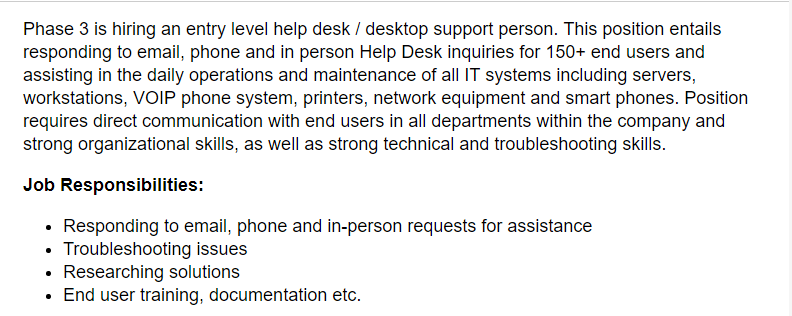
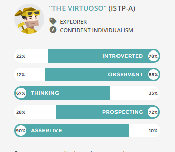
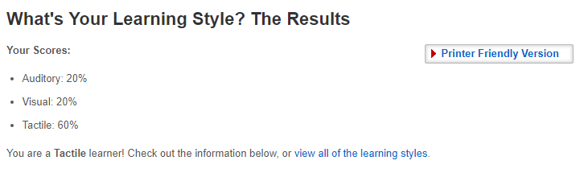
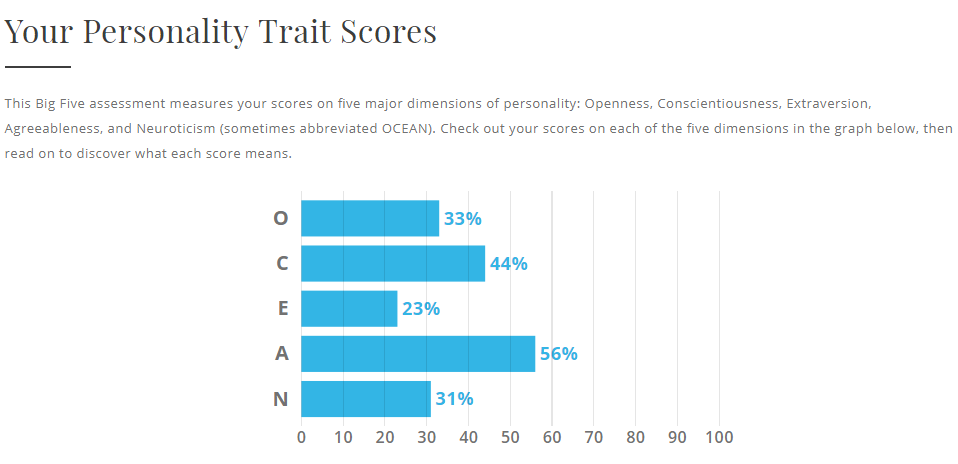

# Welcome to Anthony's Page

## Personal Information 
**Name:** Anthony Clarke

**Student ID:** s3735663

**Student Email:** s3735663@student.rmit.edu.au

**Languages:** English, Indonesian (Very Basic), Tetum (Currently Learning), Thai (Very Little) 

**Nationality:** AUS (Mother Thai, Father English) 

**Education:** Year 12 and just starting Uni

**Basic Background:** Currently living in East Timor for 2 years with my partner, I was living in Canberra Before this year. Currently working part time and studying part time as well. My Hobbies include Computer games, any sports, gym and building computers. My Favourite Hobby would be soccer although I haven’t played in a couple years due to work and living circumstances. 

## Interest in IT
**What is your interest in IT? When did your interest in IT start? Was there a particular event or person that sparked your interest? Outline your IT experience (if any).** 

Always been interested in IT, I built my first computer a couple years ago and loved it so much, would love to keep building PC’s but they are quite expensive, slowly looked further into how a computer worked and how programs worked in computers which made me want to learn more. My Interest started when I started using a computer and all the functionality it had and the progression that has come from when I started to this current date has been incredible. As stated above I have built my own PC and have assisted several friends in building theirs. I have done some programming only with Java and Python and am keen to learn more but I find it rather hard to learn at the moment. I also have a decent understanding of the components of a PC and how they each part works. 

**Why did you choose to come to RMIT?**

I chose RMIT as I wanted to Study IT part time while I was at full time work also for a future career following one of my passions.  I’ve also heard good things about RMIT and know several friends that have studied through RMIT and for my current situation of living overseas it was ideal for me to go with RMIT. 

**What do you expect to learn during your studies?**

I except to learn as much as I can from the subjects and the lecturers and further enhance my skills and knowledge that I already. I hope to fully grasp Programming as it’s such an essential skill in the IT world. 

## Ideal Job

**The job advertisement itself. Including a link, and a snapshot of it (in case the link expires before the assignment deadline).**

My ideal job would have to be IT support. This job entails assisting end users whether over the phone, via email, or in person and also entails daily operations and maintenance of all IT systems including workstations, printers, networks and so on.  
https://www.indeed.com/q-IT-Support-jobs.html?vjk=958aa1613a582f4f

**A description (in your own words) of the position, and particularly what makes this position appealing to you.**

A job like this is essential to all companies and provides a good base for an IT career. It allows people to start from the basics and provides essential skills and knowledge in all aspects of IT. One of the most appealing aspects of this job is it opens up doors to a bunch of other IT jobs and gives you a taste of every aspect so you can follow something you truly enjoy. 

**A description (in your own words) of the skills, qualifications and experience required for the position.**

This is entirely dependent on the company, some ask for people with little skills, qualifications and experience are required as they will train you from scratch to work with the software/hardware that they use. Whereas some companies will want skilled experience workers to just jump straight in and start working with the software/hardware they know. 

**A description (in your own words) of the skills, qualifications and experience you currently have.**

Currently I have an understanding of how to build/maintenance on a desktop, a very basic understanding of networking and a basic understanding of programming. I can troubleshoot basic issues with a computer and can communicate with others and work as a team. 

**A plan describing how you will obtain the skills, qualifications and experience required for the position, building on those you have now. This need not be greatly detailed, (and will probably change significantly over time anyway), but try to be as specific as you can.**

I plan to complete a bachelor in IT and further and further work on skills like programming. I also plan to do other IT courses possibly through CompTia and Cisco. Hopefully these will provide me with enough qualifications and skills to obtain a job in IT support to start my IT career.  

## Personal Profile 

**Results of an online Myers Briggs test.**

The results in this test are a good representation of myself, I am very introverted, very reliant on myself and a very hand on person. The results don’t mean a great deal to me as I already have a good understanding of who I am although it is nice to see what traits a quiz can provide to you, most being right and some being a little off.

These results won’t affect my behaviour in a team, as my everyday life at work consists of working in part of a team and contributing to various team tasks. Also having sports as a hobby, they are all team orientated and without a team you can’t beat another team by yourself. 

Taking this into account I believe I will fit into a group quiet easily and am happy to not be in control of the task at hand but still contribute as much and as often as I can to assist my fellow team mates. I may prefer to work along with people of the same or similar personality traits as me but I often get along with everyone so it shouldn’t be a big deal. 

**Results of an online learning style test.**

The results of this exam mean quite a bit as during my time at school I found it quite hard to learn in the majority of class rooms as it was just sat down and read or listen the whole time. But in the more practical classes I achieved better marks and thoroughly enjoyed those classes more. As I’d already done this test previously, I’ve been aware that I’m a practical learner. 

The results of this test shouldn’t play a major role in my behaviour in a team as the quiz is intended towards Learning Styles. 

Again, it might be better to find/join a group with the same learning styles and personality traits as me so we can assist each other.  

**Results of one further online test of your choosing**

This test was a Big Five Personality Test. The results given align well with the Myers Briggs Test. Again, the results don’t mean a whole lot, but it is nice to see what 2 different tests can provide such similar results for a user’s personality and shows that a lot of work has gone into these quizzes to provide roughly the same results. 

These results shouldn’t affect my influence as a team like stated above. 

Much a like the results in the Myers Briggs test, I believe I will fit into a group with no issues and hopefully bring something of use to the team. Much like the other 2 I may prefer to work alongside people with the same personality / learning traits and styles. 

## Project Idea

**Overview**  

My project idea is a mobile application that shows the user the closest cinema location and what movies are showing at what times. Sick and tired of having to look up different cinema’s and being unsure which one is close by? Well don’t worry this project is aimed at alleviating that issue and giving the user access to all cinema’s nearby. This application will provide users a much quicker and easier way to look up cinema timings and locations through a map function then having to look at different websites for different cinemas. This application will also have the scope for many other functions in the future some examples are purchasing food prior to movie, booking some cinema’s for events like birthday parts and many more.    
 
**Motivation**

The motivation for an application like this is simple, cinemas are located in every city and the majority of towns in Australia and around the world. With Cinema’s all around the world and movies constantly coming out this application should be essential for everyone with a smart phone. This will allow quick and easy access to cinema locations and screen timings near you. Surprisingly there is still no application that allows people to simply find a nearby cinema and show screen timing for each movie at that cinema. Instead users currently have to search through different websites and if they are travelling have the ordeal of finding which cinema is actually closest to them.  

**Description**  (500 words) 

We all love movies, well thanks to this project finding where, when and what movie we watch at the cinema will never be easier! 

Ever been sick of going from different cinema chain to cinema chain website to find the movie you want to see just to see it’s not playing? This project aims to alleviate this issue, showing all cinema chain movies and screen time in one location! With a simple search function, this allows the user to simply enter the movie name in the search bar, then giving the results of it the movie is playing at cinema’s around your location. 

If users haven’t created an account functionality is limited but they will still have access to Maps and also viewing cinemas and screen times. Once you have created an account on this application it will open up a few more functionalities like being able to book tickets, send QR tickets to friends or family, access to special promotions and the ability to review movies for other people to see. 

Having trouble remembering which movie you watched last or before that? Signing up will also give you access to a list of movies you watched with details including when and where. 

Sick and tired of waiting in line to buy your food and or ticket? Well enjoy the luxury of purchasing your ticket through this application giving you the choice of where to sit in the cinema. Once your ticket has been purchased you will receive a QR code as your ticket which you simply just show to the ticket man for him to scan. Enjoy the freedom of purchasing food to pick up when you arrive at the cinema, simply order the food you want and what time you want to pick it up just before your movie starts saving the hassle of having to stand in line and allowing you to proceed straight into your movie. 

Buying a ticket for your friend or partner? Have the freedom of being able to send their ticket to them after you purchase it. This process will work by the user sending the QR code either to the other person application or through a SMS. If you have signed up, you can also add friends to your account, this will show you what movie they watched recently / are watching and allow you to send them QR code tickets through the application. 

**Tools and Technologies**

Firstly, this application will need to utilize the GPS on the user’s phone to allow the application to find the closest cinema. The application would most likely utilize google maps as they are most used mapping tool.  It will then need to utilize open source information with software that will gather cinema locations, screen timings and additional information to use in the application. An online booking tool will be needed to allow users to book their cinema ticket, this will use QR codes for tickets allowing cinemas to easily just scan your phone and provide ticket information.  

**Skills required** 

This application will most likely need people with moderate programming skills or better to write the code for software or change the software for the application. There are many applications like this already out their but with different objectives, this software can be utilized in the application by changing parts of the code e.g. seat booking function when checking onto a flight, changed to choose the users seat for their ticket. There shouldn’t be major issues with acquiring software and hardware, but finding a skilled programmer capable of changing the code and linking all the code together for this project could be the hardest issue.  

**Outcome** 

If this project is successful, it will allow everyone access to an easy to use movie booking tool. Allowing any user to easily find cinema’s in their location or the closest cinema to them. This will allow the user to avoid having to search up cinema’s around their location and having to saving a lot of time but also giving the user a nice simple application to use.  This will be a big game changer in the way people buy tickets for a movie and a big step forward in the direction of having everything about cinema’s / screen times accessible from one application. 

